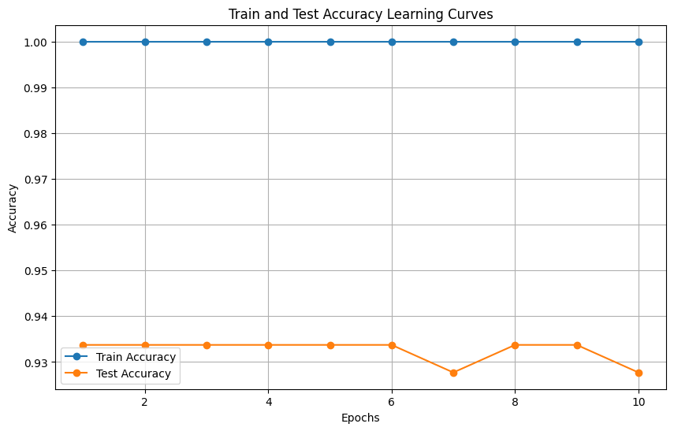
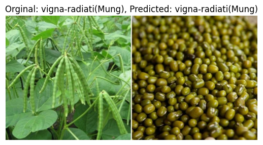
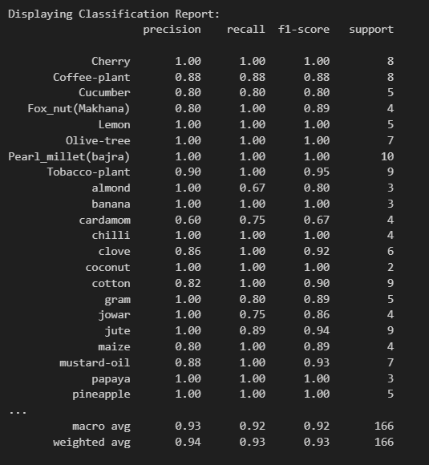
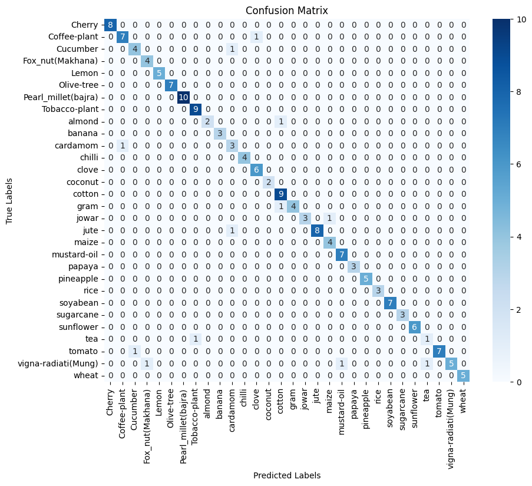

Here's a structured documentation explaining the provided code:

# Vision Transformer Image Classification

This script demonstrates how to train and evaluate a Vision Transformer (ViT) model for image classification using the PyTorch and Hugging Face Transformers libraries. The script covers dataset preparation, model training, accuracy evaluation, and visualization of predictions.

## Prerequisites

- Python environment with required libraries: `torch`, `torchvision`, `transformers`, `scikit-learn`, `PIL`, and `matplotlib`.
- Pre-trained Vision Transformer (ViT) model: `google/vit-base-patch16-224`.
- Dataset directory organized in a way compatible with `torchvision.datasets.ImageFolder`.

## Dataset:
Dataset is an agricultural crops <a ref="https://www.kaggle.com/datasets/mdwaquarazam/agricultural-crops-image-classification/data">dataset</a> Consist  Images of diferent crops.


## Code Structure

### Import Required Libraries

```python
import torch
from torch.utils.data import DataLoader, random_split
from torchvision import datasets, transforms
from transformers import ViTImageProcessor, ViTForImageClassification
from torch import nn, optim
from sklearn.metrics import accuracy_score
from PIL import Image
import os
import matplotlib.pyplot as plt
```

- **Torch and Torchvision:** For deep learning and handling image data.
- **Transformers:** To use pre-trained Vision Transformer models.
- **Scikit-learn:** For accuracy evaluation.
- **PIL and Matplotlib:** For image processing and visualization.

### Define Dataset and Transformations

```python
# Define the root directory of your dataset
data_dir = '/content/sample_data/Agricultural-crops'  # Replace with your actual path

# Define the processor and transformations
processor = ViTImageProcessor.from_pretrained('google/vit-base-patch16-224')
transform = transforms.Compose([
    transforms.Resize((224, 224)),
    transforms.ToTensor(),
    transforms.Normalize(mean=processor.image_mean, std=processor.image_std)
])

# Create a dataset using ImageFolder
dataset = datasets.ImageFolder(root=data_dir, transform=transform)
```

- **Data Directory:** Path to the dataset organized by class folders.
- **Processor and Transformations:** Use a pre-trained ViT processor to define image transformations, including resizing, normalization, and conversion to tensor.

### Split Dataset into Train and Test Sets

```python
# Calculate split sizes
train_size = int(0.8 * len(dataset))  # 80% for training
test_size = len(dataset) - train_size  # Remaining 20% for testing

# Split the dataset into train and test sets
train_dataset, test_dataset = random_split(dataset, [train_size, test_size])

# Create data loaders
train_loader = DataLoader(train_dataset, batch_size=32, shuffle=True)
test_loader = DataLoader(test_dataset, batch_size=32, shuffle=False)
```

- **Dataset Splitting:** Split the dataset into training (80%) and testing (20%) sets.
- **Data Loaders:** Prepare data loaders for batch processing and shuffling during training.

### Define the Model

```python
# Check if GPU is available, otherwise use CPU
device = torch.device("cuda" if torch.cuda.is_available() else "cpu")

model = ViTForImageClassification.from_pretrained(
    'google/vit-base-patch16-224',
    num_labels=len(dataset.classes), # Set this to match your dataset's classes
    ignore_mismatched_sizes=True # Ignore the size mismatch error
)
model.to(device)

# Define loss function and optimizer
criterion = nn.CrossEntropyLoss()
optimizer = optim.Adam(model.parameters(), lr=1e-4)
```

- **Device Selection:** Use GPU if available for faster training.
- **Model Definition:** Load a pre-trained ViT model with adjusted output layers to match the dataset classes.
- **Loss Function and Optimizer:** Use CrossEntropyLoss and Adam optimizer for model training.

### Training Loop

```python
# Lists to store accuracy values
train_accuracies = []
test_accuracies = []

# Training loop
num_epochs = 10
for epoch in range(num_epochs):
    model.train()
    running_loss = 0.0
    correct_predictions = 0
    total_predictions = 0

    for images, labels in train_loader:
        images, labels = images.to(device), labels.to(device)

        optimizer.zero_grad()
        outputs = model(images).logits
        loss = criterion(outputs, labels)
        loss.backward()
        optimizer.step()

        running_loss += loss.item()
        _, predicted = torch.max(outputs, 1)
        correct_predictions += (predicted == labels).sum().item()
        total_predictions += labels.size(0)

    train_accuracy = correct_predictions / total_predictions
    train_accuracies.append(train_accuracy)

    # Evaluate on the test dataset after each epoch
    model.eval()
    correct_predictions = 0
    total_predictions = 0

    with torch.no_grad():
        for images, labels in test_loader:
            images, labels = images.to(device), labels.to(device)

            outputs = model(images).logits
            _, predicted = torch.max(outputs, 1)
            correct_predictions += (predicted == labels).sum().item()
            total_predictions += labels.size(0)

    test_accuracy = correct_predictions / total_predictions
    test_accuracies.append(test_accuracy)

    print(f'Epoch [{epoch+1}/{num_epochs}], Loss: {running_loss/len(train_loader):.4f}, '
          f'Train Accuracy: {train_accuracy:.4f}, Test Accuracy: {test_accuracy:.4f}')
```

- **Training and Evaluation:** Train the model over multiple epochs, track training and test accuracy, and print progress.
- **Accuracy Calculation:** Store accuracy values for each epoch for visualization.

### Plot Accuracy Learning Curves



### Visualization with Predictions
```python
# Load and preprocess the image
image_path = '/content/sample_data/Agricultural-crops/vigna-radiati(Mung)/image (4).jpg'  # Replace with your image path
image = Image.open(image_path).convert('RGB')
inputs = processor(images=image, return_tensors="pt").to(device)

# Perform inference
model.eval()
with torch.no_grad():
    outputs = model(**inputs).logits

# Get predicted class
predicted_class_idx = torch.argmax(outputs, dim=1).item()
predicted_class_name = dataset.classes[predicted_class_idx]

# Get the true class name from the file path
true_class_name = image_path.split('/')[-2]  # Assuming the directory name is the class

# Display the image with true and predicted labels
plt.imshow(image)
plt.title(f'Original: {true_class_name}, Predicted: {predicted_class_name}')
plt.axis('off')
plt.show()
```
**Image Visualization:**

Displaying the image with both the true and predicted class labels.



### Classification Report of the model.




### Confusion Matrix



## Conclusion

This script provides a comprehensive approach to fine-tuning a Vision Transformer for image classification tasks, covering data preparation, model training, evaluation, and visualization. Adjust the dataset paths and model parameters as needed to suit your specific application.